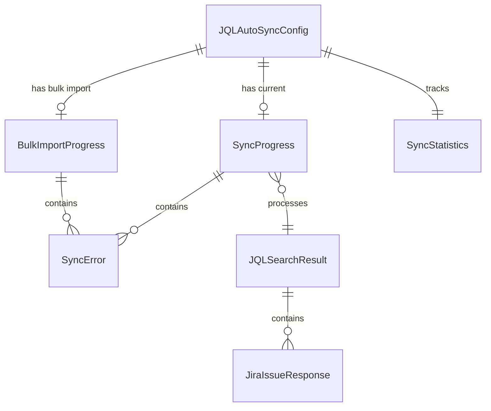

# Data Model: JQL-based Auto-Sync

**Date**: 2025-09-10  
**Phase**: 1 (Design & Contracts)  
**Status**: Complete

## Core Entities

### 1. JQLAutoSyncConfig
Configuration settings for automatic synchronization.

```typescript
interface JQLAutoSyncConfig {
  // Feature enablement
  enabled: boolean;
  
  // JQL query configuration
  jqlQuery: string;
  validateQuery: boolean;    // Whether to validate before execution
  
  // Sync timing
  syncInterval: number;      // Minutes between syncs (1-60)
  lastSyncTime: string | null; // ISO timestamp of last successful sync
  
  // Batch processing
  maxResults: number;        // Maximum results per sync (default: 1000)
  batchSize: number;         // Tickets per batch (default: 50)
  
  // State tracking
  syncInProgress: boolean;
  failedSyncCount: number;
  lastError: string | null;
  
  // Bulk import state
  bulkImportInProgress: boolean;
  bulkImportProgress: BulkImportProgress | null;
}
```

**Validation Rules**:
- `jqlQuery`: Non-empty string, valid JQL syntax when `validateQuery` is true
- `syncInterval`: Integer between 1 and 60 (minutes)
- `maxResults`: Integer between 1 and 1000
- `batchSize`: Integer between 10 and 100
- `lastSyncTime`: Valid ISO 8601 date string or null

**State Transitions**:
- `enabled`: false → true (triggers immediate sync)
- `syncInProgress`: false → true → false (during sync operations)
- `failedSyncCount`: Increments on failure, resets to 0 on success

### 2. SyncProgress
Real-time progress tracking for sync operations.

```typescript
interface SyncProgress {
  // Progress metrics
  current: number;           // Current item being processed
  total: number;             // Total items to process
  processed: number;         // Successfully processed items
  failed: number;            // Failed items
  
  // Phase tracking
  phase: SyncPhase;
  phaseStartTime: number;    // Timestamp when current phase started
  
  // Overall operation
  startTime: number;         // Sync operation start timestamp
  estimatedTimeRemaining: number | null; // Seconds (calculated)
  
  // Error collection
  errors: SyncError[];
  warnings: string[];
  
  // Cancellation
  cancellationRequested: boolean;
  cancellationToken: string | null;
}

enum SyncPhase {
  INITIALIZING = 'initializing',
  SEARCHING = 'searching',      // Executing JQL query
  DOWNLOADING = 'downloading',  // Fetching issue details
  PROCESSING = 'processing',    // Creating/updating vault files
  FINALIZING = 'finalizing',    // Cleanup and state updates
  COMPLETE = 'complete',
  CANCELLED = 'cancelled',
  ERROR = 'error'
}
```

**Relationships**:
- One `SyncProgress` per active sync operation
- Embedded in `JQLAutoSyncConfig.bulkImportProgress` for bulk operations
- Passed to UI components for progress display

### 3. BulkImportProgress
Extended progress tracking for initial bulk import operations.

```typescript
interface BulkImportProgress extends SyncProgress {
  // Batch processing
  currentBatch: number;      // Current batch being processed (1-based)
  totalBatches: number;      // Total batches to process
  batchSize: number;         // Items per batch
  
  // Resume capability
  resumeToken: string | null; // Token to resume from interruption
  processedTicketIds: string[]; // IDs of successfully processed tickets
  
  // Import-specific state
  duplicatesFound: number;    // Existing tickets skipped
  newTicketsCreated: number;  // New tickets created in vault
  ticketsUpdated: number;     // Existing tickets updated
  
  // User interaction
  allowCancel: boolean;       // Whether cancellation is allowed
  allowPause: boolean;        // Whether pausing is allowed
  isPaused: boolean;         // Current pause state
}
```

**Business Rules**:
- `resumeToken`: Set when import is paused/interrupted, cleared on completion
- `duplicatesFound + newTicketsCreated + ticketsUpdated = processed`
- `allowCancel` typically true during download/processing phases

### 4. JQLSearchResult
Response from new Jira API search endpoint.

```typescript
interface JQLSearchResult {
  // API response metadata
  maxResults: number;
  startAt: number;           // Always 0 for new token-based API
  total: number;             // Approximate total (may change)
  
  // Pagination
  nextPageToken?: string;    // Token for next page (undefined when last page)
  
  // Results
  issues: JiraIssueResponse[];
  
  // Query context
  jql: string;               // Query that generated these results
  executionTime: number;     // Query execution time in milliseconds
}

interface JiraIssueResponse {
  // Core identification
  id: string;                // Jira internal ID
  key: string;               // Human-readable key (e.g., "PROJ-123")
  self: string;              // REST API URL for this issue
  
  // Field data (only requested fields returned)
  fields: {
    summary?: string;
    status?: {
      name: string;
      statusCategory: {
        key: string;           // "new", "indeterminate", "done"
        colorName: string;
      };
    };
    assignee?: {
      accountId: string;
      displayName: string;
      emailAddress?: string;
    };
    priority?: {
      name: string;
      iconUrl: string;
    };
    created?: string;          // ISO timestamp
    updated?: string;          // ISO timestamp
    description?: any;         // Atlassian Document Format
    project?: {
      key: string;
      name: string;
    };
  };
  
  // Expanded data (if requested)
  changelog?: {
    histories: ChangelogEntry[];
  };
}
```

**Field Selection Strategy**:
- Always request: `id`, `key`, `summary`, `status`, `updated`
- Configurable: `assignee`, `priority`, `description`, `created`
- On-demand: `changelog`, `comments`, `attachment`

### 5. SyncError
Structured error information for operation failures.

```typescript
interface SyncError {
  // Error identification
  code: string;              // Error code (e.g., "API_RATE_LIMIT", "NETWORK_ERROR")
  message: string;           // Human-readable error message
  
  // Context
  phase: SyncPhase;          // Phase where error occurred
  timestamp: number;         // When error occurred
  
  // Technical details
  originalError?: Error;     // Underlying JavaScript error
  apiResponse?: {            // Jira API error response
    status: number;
    statusText: string;
    body: any;
  };
  
  // Retry information
  retryAttempt: number;      // Which retry attempt failed (0 = first attempt)
  maxRetries: number;        // Maximum retry attempts allowed
  nextRetryAt?: number;      // Timestamp when next retry will occur
  
  // User context
  ticketId?: string;         // Ticket ID related to error (if applicable)
  userAction?: string;       // User action that triggered the error
}
```

**Error Categories**:
- **API Errors**: `API_RATE_LIMIT`, `API_AUTH_FAILED`, `API_INVALID_JQL`
- **Network Errors**: `NETWORK_TIMEOUT`, `NETWORK_OFFLINE`, `NETWORK_ERROR`
- **Vault Errors**: `VAULT_WRITE_FAILED`, `VAULT_READ_FAILED`, `VAULT_PERMISSION`
- **Logic Errors**: `INVALID_CONFIG`, `BATCH_SIZE_EXCEEDED`, `PARSE_ERROR`

### 6. SyncStatistics
Aggregated metrics for sync operations monitoring.

```typescript
interface SyncStatistics {
  // Overall metrics
  totalSyncOperations: number;
  successfulSyncs: number;
  failedSyncs: number;
  
  // Timing metrics
  averageSyncDuration: number;    // Seconds
  lastSyncDuration: number;       // Seconds
  longestSyncDuration: number;    // Seconds
  
  // Volume metrics
  totalTicketsProcessed: number;
  ticketsCreated: number;
  ticketsUpdated: number;
  ticketsSkipped: number;         // Duplicates or filtered out
  
  // Error tracking
  errorsByCategory: Record<string, number>; // Error code → count
  consecutiveFailures: number;
  
  // Performance metrics
  averageTicketsPerSecond: number;
  apiCallsThisHour: number;       // Rate limiting tracking
  
  // Time series data (last 24 hours)
  hourlyStats: Array<{
    hour: number;                 // Unix timestamp rounded to hour
    syncs: number;
    tickets: number;
    errors: number;
  }>;
}
```

**Update Strategy**:
- Increment counters after each operation
- Recalculate averages using rolling window
- Persist statistics to plugin storage
- Reset counters periodically to prevent overflow

## Entity Relationships



## Data Storage Strategy

### Plugin Settings (Persistent)
- `JQLAutoSyncConfig` → `plugin.saveData()`
- `SyncStatistics` → `plugin.saveData()`

### Runtime State (Memory)
- `SyncProgress` → Component state
- `BulkImportProgress` → Modal state
- `JQLSearchResult` → Temporary processing cache

### Error Recovery
- `SyncError` array → Persisted for post-mortem analysis
- Resume tokens → Stored until operation completion
- Failed batch queue → Persisted for retry attempts

---
**Data Model Complete**: All entities defined with validation rules and relationships documented.