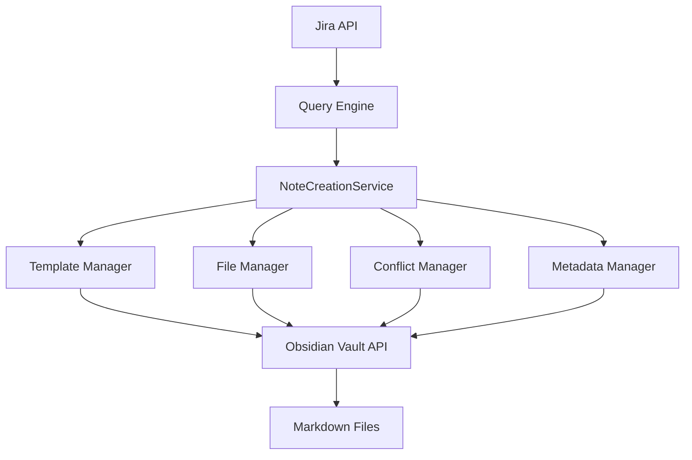

# Note Creation Service Implementation Spec

## Overview
The NoteCreationService is the core component responsible for creating, updating, and managing Jira ticket notes within the Obsidian vault. This service bridges the gap between Jira data and Obsidian's file system.

## Architecture



## Core Components

### 1. NoteCreationService (Main Class)

```typescript
// src/services/note-creation-service.ts

import { Plugin, TFile, TFolder, Vault, normalizePath } from 'obsidian';
import { JiraIssue } from '../models/jql-search-result';
import { TemplateManager } from './template-manager';
import { ConflictManager } from './conflict-manager';
import { MetadataManager } from './metadata-manager';

export interface NoteCreationOptions {
  template?: string;
  preserveLocalChanges?: boolean;
  conflictStrategy?: ConflictStrategy;
  organizationStrategy?: OrganizationStrategy;
}

export enum ConflictStrategy {
  SERVER_WINS = 'server_wins',
  LOCAL_WINS = 'local_wins',
  MERGE = 'merge',
  MANUAL = 'manual'
}

export enum OrganizationStrategy {
  FLAT = 'flat',              // All tickets in one folder
  BY_PROJECT = 'by_project',  // Organized by project key
  BY_STATUS = 'by_status',    // Organized by status
  BY_ASSIGNEE = 'by_assignee' // Organized by assignee
}

export class NoteCreationService {
  private vault: Vault;
  private templateManager: TemplateManager;
  private conflictManager: ConflictManager;
  private metadataManager: MetadataManager;
  
  constructor(
    private plugin: Plugin,
    private baseFolder: string
  ) {
    this.vault = plugin.app.vault;
    this.templateManager = new TemplateManager(plugin);
    this.conflictManager = new ConflictManager(plugin);
    this.metadataManager = new MetadataManager(plugin);
  }

  /**
   * Create or update a note for a Jira ticket
   */
  async processTicket(
    ticket: JiraIssue,
    options: NoteCreationOptions = {}
  ): Promise<ProcessResult> {
    try {
      // 1. Determine file path
      const filePath = await this.getFilePath(ticket, options.organizationStrategy);
      
      // 2. Check if file exists
      const existingFile = this.vault.getAbstractFileByPath(filePath);
      
      if (existingFile instanceof TFile) {
        // Update existing note
        return await this.updateNote(existingFile, ticket, options);
      } else {
        // Create new note
        return await this.createNote(filePath, ticket, options);
      }
    } catch (error) {
      return {
        success: false,
        error: error.message,
        ticket: ticket.key
      };
    }
  }

  /**
   * Create a new note for a ticket
   */
  private async createNote(
    filePath: string,
    ticket: JiraIssue,
    options: NoteCreationOptions
  ): Promise<ProcessResult> {
    // Ensure folder exists
    await this.ensureFolderExists(filePath);
    
    // Generate content from template
    const content = await this.templateManager.generateContent(ticket, options.template);
    
    // Create the file
    const file = await this.vault.create(filePath, content);
    
    // Store metadata for sync tracking
    await this.metadataManager.storeMetadata(file, {
      ticketKey: ticket.key,
      lastSyncedVersion: ticket.fields.updated,
      syncDate: new Date().toISOString(),
      hash: this.generateContentHash(content)
    });
    
    return {
      success: true,
      action: 'created',
      file: file,
      ticket: ticket.key
    };
  }

  /**
   * Update an existing note
   */
  private async updateNote(
    file: TFile,
    ticket: JiraIssue,
    options: NoteCreationOptions
  ): Promise<ProcessResult> {
    const currentContent = await this.vault.read(file);
    const metadata = await this.metadataManager.getMetadata(file);
    
    // Check for conflicts
    const hasLocalChanges = await this.detectLocalChanges(file, metadata);
    
    if (hasLocalChanges && options.preserveLocalChanges) {
      // Handle conflict based on strategy
      return await this.handleConflict(file, ticket, currentContent, options);
    }
    
    // Generate new content
    const newContent = await this.templateManager.updateContent(
      currentContent,
      ticket,
      options.template
    );
    
    // Update the file
    await this.vault.modify(file, newContent);
    
    // Update metadata
    await this.metadataManager.updateMetadata(file, {
      lastSyncedVersion: ticket.fields.updated,
      syncDate: new Date().toISOString(),
      hash: this.generateContentHash(newContent)
    });
    
    return {
      success: true,
      action: 'updated',
      file: file,
      ticket: ticket.key
    };
  }

  /**
   * Handle sync conflicts
   */
  private async handleConflict(
    file: TFile,
    ticket: JiraIssue,
    currentContent: string,
    options: NoteCreationOptions
  ): Promise<ProcessResult> {
    const strategy = options.conflictStrategy || ConflictStrategy.MERGE;
    
    switch (strategy) {
      case ConflictStrategy.SERVER_WINS:
        // Overwrite with server data
        const serverContent = await this.templateManager.generateContent(ticket);
        await this.vault.modify(file, serverContent);
        return { success: true, action: 'overwritten', file, ticket: ticket.key };
        
      case ConflictStrategy.LOCAL_WINS:
        // Keep local changes, only update metadata
        await this.metadataManager.updateSyncDate(file);
        return { success: true, action: 'skipped', file, ticket: ticket.key };
        
      case ConflictStrategy.MERGE:
        // Intelligent merge
        const mergedContent = await this.conflictManager.mergeContent(
          currentContent,
          ticket
        );
        await this.vault.modify(file, mergedContent);
        return { success: true, action: 'merged', file, ticket: ticket.key };
        
      case ConflictStrategy.MANUAL:
        // Create conflict file for manual resolution
        await this.conflictManager.createConflictFile(file, ticket);
        return { 
          success: true, 
          action: 'conflict_created', 
          file, 
          ticket: ticket.key,
          requiresManualResolution: true
        };
    }
  }

  /**
   * Determine the file path for a ticket
   */
  private async getFilePath(
    ticket: JiraIssue,
    strategy: OrganizationStrategy = OrganizationStrategy.BY_PROJECT
  ): Promise<string> {
    const safeKey = this.sanitizeFileName(ticket.key);
    const baseFolder = normalizePath(this.baseFolder);
    
    switch (strategy) {
      case OrganizationStrategy.FLAT:
        return `${baseFolder}/${safeKey}.md`;
        
      case OrganizationStrategy.BY_PROJECT:
        const project = ticket.fields.project.key;
        return `${baseFolder}/${project}/${safeKey}.md`;
        
      case OrganizationStrategy.BY_STATUS:
        const status = this.sanitizeFileName(ticket.fields.status.name);
        return `${baseFolder}/${status}/${safeKey}.md`;
        
      case OrganizationStrategy.BY_ASSIGNEE:
        const assignee = ticket.fields.assignee?.displayName || 'Unassigned';
        const safeAssignee = this.sanitizeFileName(assignee);
        return `${baseFolder}/${safeAssignee}/${safeKey}.md`;
        
      default:
        return `${baseFolder}/${safeKey}.md`;
    }
  }

  /**
   * Ensure folder structure exists
   */
  private async ensureFolderExists(filePath: string): Promise<void> {
    const folderPath = filePath.substring(0, filePath.lastIndexOf('/'));
    const folder = this.vault.getAbstractFileByPath(folderPath);
    
    if (!folder) {
      await this.vault.createFolder(folderPath);
    }
  }

  /**
   * Detect if file has local changes
   */
  private async detectLocalChanges(file: TFile, metadata: any): Promise<boolean> {
    if (!metadata || !metadata.hash) return false;
    
    const currentContent = await this.vault.read(file);
    const currentHash = this.generateContentHash(currentContent);
    
    return currentHash !== metadata.hash;
  }

  /**
   * Generate content hash for change detection
   */
  private generateContentHash(content: string): string {
    // Simple hash for change detection
    let hash = 0;
    for (let i = 0; i < content.length; i++) {
      const char = content.charCodeAt(i);
      hash = ((hash << 5) - hash) + char;
      hash = hash & hash; // Convert to 32-bit integer
    }
    return hash.toString(36);
  }

  /**
   * Sanitize file names for filesystem
   */
  private sanitizeFileName(name: string): string {
    return name
      .replace(/[\\/:*?"<>|]/g, '-') // Replace invalid characters
      .replace(/\s+/g, '_')           // Replace spaces with underscores
      .replace(/^\.+/, '')            // Remove leading dots
      .trim();
  }
}

interface ProcessResult {
  success: boolean;
  action?: 'created' | 'updated' | 'merged' | 'skipped' | 'overwritten' | 'conflict_created';
  file?: TFile;
  ticket: string;
  error?: string;
  requiresManualResolution?: boolean;
}
```

### 2. Template Manager

```typescript
// src/services/template-manager.ts

export class TemplateManager {
  private defaultTemplate = `---
ticket: {{key}}
title: {{summary}}
status: {{status}}
assignee: {{assignee}}
priority: {{priority}}
type: {{issueType}}
project: {{project}}
created: {{created}}
updated: {{updated}}
resolved: {{resolved}}
labels: {{labels}}
jira_url: {{url}}
sync_date: {{sync_date}}
---

# [{{key}}] {{summary}}

## Status Information
- **Current Status**: {{status}}
- **Priority**: {{priority}} {{priorityIcon}}
- **Type**: {{issueType}}
- **Assignee**: {{assignee}}
- **Reporter**: {{reporter}}

## Description
{{description}}

## Acceptance Criteria
{{acceptanceCriteria}}

## Comments
{{#comments}}
### {{author}} - {{date}}
{{body}}

{{/comments}}

## Attachments
{{#attachments}}
- [{{filename}}]({{url}})
{{/attachments}}

## Subtasks
{{#subtasks}}
- [ ] [{{key}}]({{url}}) - {{summary}} ({{status}})
{{/subtasks}}

## Links
{{#links}}
- {{type}}: [{{key}}]({{url}}) - {{summary}}
{{/links}}

---
*Last synced: {{sync_date}}*

## Local Notes
<!-- Everything below this line is preserved during sync -->

`;

  async generateContent(ticket: JiraIssue, template?: string): Promise<string> {
    const templateStr = template || this.defaultTemplate;
    return this.processTemplate(templateStr, ticket);
  }

  async updateContent(
    currentContent: string,
    ticket: JiraIssue,
    template?: string
  ): Promise<string> {
    // Extract local notes section
    const localNotes = this.extractLocalNotes(currentContent);
    
    // Generate new content
    const newContent = await this.generateContent(ticket, template);
    
    // Append preserved local notes
    if (localNotes) {
      return newContent.replace(
        '## Local Notes\n<!-- Everything below this line is preserved during sync -->',
        `## Local Notes\n<!-- Everything below this line is preserved during sync -->\n${localNotes}`
      );
    }
    
    return newContent;
  }

  private extractLocalNotes(content: string): string {
    const marker = '<!-- Everything below this line is preserved during sync -->';
    const index = content.indexOf(marker);
    
    if (index !== -1) {
      return content.substring(index + marker.length).trim();
    }
    
    return '';
  }

  private processTemplate(template: string, ticket: JiraIssue): string {
    // Process all template variables
    let processed = template;
    
    // Basic fields
    processed = processed.replace(/{{key}}/g, ticket.key);
    processed = processed.replace(/{{summary}}/g, ticket.fields.summary);
    processed = processed.replace(/{{status}}/g, ticket.fields.status.name);
    processed = processed.replace(/{{priority}}/g, ticket.fields.priority?.name || 'None');
    processed = processed.replace(/{{issueType}}/g, ticket.fields.issuetype.name);
    processed = processed.replace(/{{project}}/g, ticket.fields.project.name);
    
    // People fields
    processed = processed.replace(/{{assignee}}/g, 
      ticket.fields.assignee?.displayName || 'Unassigned');
    processed = processed.replace(/{{reporter}}/g, 
      ticket.fields.reporter?.displayName || 'Unknown');
    
    // Dates
    processed = processed.replace(/{{created}}/g, 
      this.formatDate(ticket.fields.created));
    processed = processed.replace(/{{updated}}/g, 
      this.formatDate(ticket.fields.updated));
    processed = processed.replace(/{{resolved}}/g, 
      ticket.fields.resolutiondate ? this.formatDate(ticket.fields.resolutiondate) : 'Not resolved');
    
    // Description with markdown conversion
    processed = processed.replace(/{{description}}/g, 
      this.convertJiraToMarkdown(ticket.fields.description || 'No description'));
    
    // URLs
    const jiraUrl = `${ticket.self.split('/rest/')[0]}/browse/${ticket.key}`;
    processed = processed.replace(/{{url}}/g, jiraUrl);
    
    // Current sync date
    processed = processed.replace(/{{sync_date}}/g, 
      new Date().toISOString());
    
    // Priority icon
    processed = processed.replace(/{{priorityIcon}}/g, 
      this.getPriorityIcon(ticket.fields.priority?.name));
    
    // Arrays (labels)
    processed = processed.replace(/{{labels}}/g, 
      ticket.fields.labels?.join(', ') || 'None');
    
    // Process comments section
    processed = this.processComments(processed, ticket);
    
    // Process attachments section
    processed = this.processAttachments(processed, ticket);
    
    // Process subtasks section
    processed = this.processSubtasks(processed, ticket);
    
    // Process links section
    processed = this.processLinks(processed, ticket);
    
    // Process acceptance criteria (custom field)
    processed = this.processAcceptanceCriteria(processed, ticket);
    
    return processed;
  }

  private processComments(template: string, ticket: JiraIssue): string {
    const commentsPattern = /{{#comments}}([\s\S]*?){{\/comments}}/g;
    
    if (!ticket.fields.comment?.comments || ticket.fields.comment.comments.length === 0) {
      return template.replace(commentsPattern, '*No comments*');
    }
    
    return template.replace(commentsPattern, (match, commentTemplate) => {
      return ticket.fields.comment.comments
        .map(comment => {
          let commentStr = commentTemplate;
          commentStr = commentStr.replace(/{{author}}/g, comment.author.displayName);
          commentStr = commentStr.replace(/{{date}}/g, this.formatDate(comment.created));
          commentStr = commentStr.replace(/{{body}}/g, 
            this.convertJiraToMarkdown(comment.body));
          return commentStr.trim();
        })
        .join('\n\n');
    });
  }

  private processAttachments(template: string, ticket: JiraIssue): string {
    const attachmentsPattern = /{{#attachments}}([\s\S]*?){{\/attachments}}/g;
    
    if (!ticket.fields.attachment || ticket.fields.attachment.length === 0) {
      return template.replace(attachmentsPattern, '*No attachments*');
    }
    
    return template.replace(attachmentsPattern, (match, attachmentTemplate) => {
      return ticket.fields.attachment
        .map(attachment => {
          let attachStr = attachmentTemplate;
          attachStr = attachStr.replace(/{{filename}}/g, attachment.filename);
          attachStr = attachStr.replace(/{{url}}/g, attachment.content);
          return attachStr.trim();
        })
        .join('\n');
    });
  }

  private processSubtasks(template: string, ticket: JiraIssue): string {
    const subtasksPattern = /{{#subtasks}}([\s\S]*?){{\/subtasks}}/g;
    
    if (!ticket.fields.subtasks || ticket.fields.subtasks.length === 0) {
      return template.replace(subtasksPattern, '*No subtasks*');
    }
    
    return template.replace(subtasksPattern, (match, subtaskTemplate) => {
      return ticket.fields.subtasks
        .map(subtask => {
          let subtaskStr = subtaskTemplate;
          subtaskStr = subtaskStr.replace(/{{key}}/g, subtask.key);
          subtaskStr = subtaskStr.replace(/{{summary}}/g, subtask.fields.summary);
          subtaskStr = subtaskStr.replace(/{{status}}/g, subtask.fields.status.name);
          const subtaskUrl = `${ticket.self.split('/rest/')[0]}/browse/${subtask.key}`;
          subtaskStr = subtaskStr.replace(/{{url}}/g, subtaskUrl);
          return subtaskStr.trim();
        })
        .join('\n');
    });
  }

  private processLinks(template: string, ticket: JiraIssue): string {
    const linksPattern = /{{#links}}([\s\S]*?){{\/links}}/g;
    
    if (!ticket.fields.issuelinks || ticket.fields.issuelinks.length === 0) {
      return template.replace(linksPattern, '*No linked issues*');
    }
    
    return template.replace(linksPattern, (match, linkTemplate) => {
      return ticket.fields.issuelinks
        .map(link => {
          const linkedIssue = link.outwardIssue || link.inwardIssue;
          if (!linkedIssue) return '';
          
          let linkStr = linkTemplate;
          linkStr = linkStr.replace(/{{type}}/g, 
            link.type.outward || link.type.inward);
          linkStr = linkStr.replace(/{{key}}/g, linkedIssue.key);
          linkStr = linkStr.replace(/{{summary}}/g, linkedIssue.fields.summary);
          const linkUrl = `${ticket.self.split('/rest/')[0]}/browse/${linkedIssue.key}`;
          linkStr = linkStr.replace(/{{url}}/g, linkUrl);
          return linkStr.trim();
        })
        .filter(link => link !== '')
        .join('\n');
    });
  }

  private processAcceptanceCriteria(template: string, ticket: JiraIssue): string {
    // Look for acceptance criteria in custom fields
    const customFields = ticket.fields;
    let acceptanceCriteria = '';
    
    // Common custom field names for acceptance criteria
    const possibleFields = [
      'customfield_10001',
      'customfield_10002',
      'customfield_10100',
      'acceptance_criteria',
      'acceptanceCriteria'
    ];
    
    for (const field of possibleFields) {
      if (customFields[field]) {
        acceptanceCriteria = customFields[field];
        break;
      }
    }
    
    return template.replace(/{{acceptanceCriteria}}/g, 
      acceptanceCriteria ? this.convertJiraToMarkdown(acceptanceCriteria) : '*No acceptance criteria defined*');
  }

  private convertJiraToMarkdown(jiraText: string): string {
    if (!jiraText) return '';
    
    let markdown = jiraText;
    
    // Convert Jira headers to Markdown headers
    markdown = markdown.replace(/^h1\.\s+(.+)$/gm, '# $1');
    markdown = markdown.replace(/^h2\.\s+(.+)$/gm, '## $1');
    markdown = markdown.replace(/^h3\.\s+(.+)$/gm, '### $1');
    markdown = markdown.replace(/^h4\.\s+(.+)$/gm, '#### $1');
    markdown = markdown.replace(/^h5\.\s+(.+)$/gm, '##### $1');
    markdown = markdown.replace(/^h6\.\s+(.+)$/gm, '###### $1');
    
    // Convert Jira bold to Markdown bold
    markdown = markdown.replace(/\*(.+?)\*/g, '**$1**');
    
    // Convert Jira italic to Markdown italic
    markdown = markdown.replace(/_(.+?)_/g, '*$1*');
    
    // Convert Jira strikethrough to Markdown strikethrough
    markdown = markdown.replace(/-(.+?)-/g, '~~$1~~');
    
    // Convert Jira code blocks
    markdown = markdown.replace(/\{code:?(\w+)?\}([\s\S]*?)\{code\}/g, '```$1\n$2\n```');
    markdown = markdown.replace(/\{noformat\}([\s\S]*?)\{noformat\}/g, '```\n$1\n```');
    
    // Convert Jira inline code
    markdown = markdown.replace(/\{\{(.+?)\}\}/g, '`$1`');
    
    // Convert Jira links
    markdown = markdown.replace(/\[(.+?)\|(.+?)\]/g, '[$1]($2)');
    
    // Convert Jira lists
    markdown = markdown.replace(/^\*\s+(.+)$/gm, '- $1');
    markdown = markdown.replace(/^#\s+(.+)$/gm, '1. $1');
    
    // Convert Jira tables
    markdown = markdown.replace(/\|\|(.+?)\|\|/g, '| **$1** |');
    
    // Convert Jira quotes
    markdown = markdown.replace(/^bq\.\s+(.+)$/gm, '> $1');
    
    // Convert mentions
    markdown = markdown.replace(/\[~(.+?)\]/g, '@$1');
    
    return markdown;
  }

  private formatDate(dateString: string): string {
    const date = new Date(dateString);
    return date.toLocaleDateString('en-US', {
      year: 'numeric',
      month: 'short',
      day: 'numeric',
      hour: '2-digit',
      minute: '2-digit'
    });
  }

  private getPriorityIcon(priority?: string): string {
    const icons: Record<string, string> = {
      'Highest': '🔴',
      'High': '🟠',
      'Medium': '🟡',
      'Low': '🟢',
      'Lowest': '⚪'
    };
    return icons[priority || ''] || '';
  }
}
```

### 3. Conflict Manager

```typescript
// src/services/conflict-manager.ts

export class ConflictManager {
  constructor(private plugin: Plugin) {}

  async mergeContent(localContent: string, ticket: JiraIssue): Promise<string> {
    // Extract sections from local content
    const localSections = this.parseSections(localContent);
    
    // Generate fresh server content
    const templateManager = new TemplateManager(this.plugin);
    const serverContent = await templateManager.generateContent(ticket);
    const serverSections = this.parseSections(serverContent);
    
    // Merge strategy:
    // 1. Use server data for frontmatter
    // 2. Use server data for Jira fields
    // 3. Preserve local notes section
    // 4. Add conflict markers for conflicting sections
    
    const merged: string[] = [];
    
    // Always use server frontmatter
    merged.push(serverSections.frontmatter);
    
    // Main content sections
    for (const section of Object.keys(serverSections)) {
      if (section === 'frontmatter') continue;
      if (section === 'localNotes') {
        // Always preserve local notes
        merged.push(localSections.localNotes || serverSections.localNotes);
      } else if (this.hasLocalModification(localSections[section], serverSections[section])) {
        // Add conflict markers
        merged.push(this.createConflictSection(
          section,
          localSections[section],
          serverSections[section]
        ));
      } else {
        // Use server version
        merged.push(serverSections[section]);
      }
    }
    
    return merged.join('\n\n');
  }

  async createConflictFile(file: TFile, ticket: JiraIssue): Promise<void> {
    const vault = this.plugin.app.vault;
    const conflictPath = file.path.replace('.md', '.conflict.md');
    
    const templateManager = new TemplateManager(this.plugin);
    const serverContent = await templateManager.generateContent(ticket);
    
    const conflictContent = `# Sync Conflict for ${ticket.key}

## ⚠️ Manual Resolution Required

A sync conflict was detected for this ticket. Please review both versions and manually resolve.

### Conflict Details
- **Ticket**: ${ticket.key}
- **Original File**: ${file.path}
- **Conflict Detected**: ${new Date().toISOString()}
- **Last Jira Update**: ${ticket.fields.updated}

---

## 📄 Current Local Version
\`\`\`markdown
${await vault.read(file)}
\`\`\`

---

## 🌐 Latest Server Version
\`\`\`markdown
${serverContent}
\`\`\`

---

## 📝 Resolution Instructions

1. Review both versions above
2. Edit the original file (${file.path}) with your desired content
3. Delete this conflict file once resolved
4. Run sync again to update metadata

### Quick Actions
- [ ] Reviewed local version
- [ ] Reviewed server version
- [ ] Resolved conflicts in original file
- [ ] Deleted this conflict file
`;
    
    await vault.create(conflictPath, conflictContent);
  }

  private parseSections(content: string): Record<string, string> {
    const sections: Record<string, string> = {};
    
    // Extract frontmatter
    const frontmatterMatch = content.match(/^---\n([\s\S]*?)\n---/);
    if (frontmatterMatch) {
      sections.frontmatter = frontmatterMatch[0];
    }
    
    // Extract local notes
    const localNotesMarker = '<!-- Everything below this line is preserved during sync -->';
    const localNotesIndex = content.indexOf(localNotesMarker);
    if (localNotesIndex !== -1) {
      sections.localNotes = content.substring(localNotesIndex);
    }
    
    // Extract other sections by headers
    const sectionPattern = /^#{1,6}\s+(.+)$/gm;
    let match;
    let lastIndex = frontmatterMatch ? frontmatterMatch[0].length : 0;
    
    while ((match = sectionPattern.exec(content)) !== null) {
      const sectionName = match[1];
      const sectionStart = match.index;
      const sectionContent = content.substring(lastIndex, sectionStart);
      
      if (sectionContent.trim()) {
        sections[sectionName] = sectionContent;
      }
      
      lastIndex = sectionStart;
    }
    
    return sections;
  }

  private hasLocalModification(localSection: string, serverSection: string): boolean {
    if (!localSection || !serverSection) return false;
    
    // Normalize whitespace for comparison
    const normalizedLocal = localSection.replace(/\s+/g, ' ').trim();
    const normalizedServer = serverSection.replace(/\s+/g, ' ').trim();
    
    return normalizedLocal !== normalizedServer;
  }

  private createConflictSection(
    sectionName: string,
    localContent: string,
    serverContent: string
  ): string {
    return `<<<<<<< LOCAL (Your Changes)
${localContent}
=======
${serverContent}
>>>>>>> SERVER (Jira Update)

⚠️ **Conflict in section: ${sectionName}**
Please resolve this conflict by choosing one version or manually merging the content.`;
  }
}
```

### 4. Metadata Manager

```typescript
// src/services/metadata-manager.ts

export interface SyncMetadata {
  ticketKey: string;
  lastSyncedVersion: string;
  syncDate: string;
  hash: string;
  conflictState?: 'none' | 'resolved' | 'pending';
  customFields?: Record<string, any>;
}

export class MetadataManager {
  private metadataCache: Map<string, SyncMetadata> = new Map();
  
  constructor(private plugin: Plugin) {
    this.loadMetadataCache();
  }

  async storeMetadata(file: TFile, metadata: SyncMetadata): Promise<void> {
    const fileCache = this.plugin.app.metadataCache.getFileCache(file);
    
    // Store in frontmatter
    await this.updateFrontmatter(file, {
      'jira-sync': {
        ticketKey: metadata.ticketKey,
        lastSync: metadata.syncDate,
        version: metadata.lastSyncedVersion,
        hash: metadata.hash
      }
    });
    
    // Store in cache
    this.metadataCache.set(file.path, metadata);
    await this.saveMetadataCache();
  }

  async getMetadata(file: TFile): Promise<SyncMetadata | null> {
    // Try cache first
    if (this.metadataCache.has(file.path)) {
      return this.metadataCache.get(file.path)!;
    }
    
    // Read from frontmatter
    const fileCache = this.plugin.app.metadataCache.getFileCache(file);
    const frontmatter = fileCache?.frontmatter;
    
    if (frontmatter?.['jira-sync']) {
      const syncData = frontmatter['jira-sync'];
      const metadata: SyncMetadata = {
        ticketKey: syncData.ticketKey,
        lastSyncedVersion: syncData.version,
        syncDate: syncData.lastSync,
        hash: syncData.hash,
        conflictState: syncData.conflictState || 'none'
      };
      
      // Update cache
      this.metadataCache.set(file.path, metadata);
      return metadata;
    }
    
    return null;
  }

  async updateMetadata(file: TFile, updates: Partial<SyncMetadata>): Promise<void> {
    const existing = await this.getMetadata(file);
    const updated = { ...existing, ...updates } as SyncMetadata;
    await this.storeMetadata(file, updated);
  }

  async updateSyncDate(file: TFile): Promise<void> {
    await this.updateMetadata(file, {
      syncDate: new Date().toISOString()
    });
  }

  private async updateFrontmatter(file: TFile, data: Record<string, any>): Promise<void> {
    const content = await this.plugin.app.vault.read(file);
    const frontmatterRegex = /^---\n([\s\S]*?)\n---/;
    const match = content.match(frontmatterRegex);
    
    let newFrontmatter: string;
    
    if (match) {
      // Parse existing frontmatter
      const existing = this.parseFrontmatter(match[1]);
      const updated = { ...existing, ...data };
      newFrontmatter = this.stringifyFrontmatter(updated);
      
      const newContent = content.replace(
        frontmatterRegex,
        `---\n${newFrontmatter}\n---`
      );
      await this.plugin.app.vault.modify(file, newContent);
    } else {
      // Add new frontmatter
      newFrontmatter = this.stringifyFrontmatter(data);
      const newContent = `---\n${newFrontmatter}\n---\n\n${content}`;
      await this.plugin.app.vault.modify(file, newContent);
    }
  }

  private parseFrontmatter(frontmatter: string): Record<string, any> {
    const result: Record<string, any> = {};
    const lines = frontmatter.split('\n');
    
    for (const line of lines) {
      const colonIndex = line.indexOf(':');
      if (colonIndex > 0) {
        const key = line.substring(0, colonIndex).trim();
        const value = line.substring(colonIndex + 1).trim();
        result[key] = this.parseValue(value);
      }
    }
    
    return result;
  }

  private stringifyFrontmatter(data: Record<string, any>): string {
    const lines: string[] = [];
    
    for (const [key, value] of Object.entries(data)) {
      if (typeof value === 'object' && value !== null) {
        lines.push(`${key}:`);
        for (const [subKey, subValue] of Object.entries(value)) {
          lines.push(`  ${subKey}: ${this.stringifyValue(subValue)}`);
        }
      } else {
        lines.push(`${key}: ${this.stringifyValue(value)}`);
      }
    }
    
    return lines.join('\n');
  }

  private parseValue(value: string): any {
    if (value === 'true') return true;
    if (value === 'false') return false;
    if (value === 'null') return null;
    if (/^\d+$/.test(value)) return parseInt(value);
    if (/^\d+\.\d+$/.test(value)) return parseFloat(value);
    return value;
  }

  private stringifyValue(value: any): string {
    if (value === null) return 'null';
    if (typeof value === 'boolean') return value.toString();
    if (typeof value === 'number') return value.toString();
    if (typeof value === 'string') {
      // Quote if contains special characters
      if (value.includes(':') || value.includes('#') || value.includes('|')) {
        return `"${value}"`;
      }
      return value;
    }
    return JSON.stringify(value);
  }

  private async loadMetadataCache(): Promise<void> {
    const cacheFile = `${this.plugin.manifest.dir}/.sync-metadata.json`;
    
    try {
      const data = await this.plugin.app.vault.adapter.read(cacheFile);
      const parsed = JSON.parse(data);
      this.metadataCache = new Map(Object.entries(parsed));
    } catch (error) {
      // Cache file doesn't exist or is invalid
      this.metadataCache = new Map();
    }
  }

  private async saveMetadataCache(): Promise<void> {
    const cacheFile = `${this.plugin.manifest.dir}/.sync-metadata.json`;
    const data = Object.fromEntries(this.metadataCache);
    
    try {
      await this.plugin.app.vault.adapter.write(
        cacheFile,
        JSON.stringify(data, null, 2)
      );
    } catch (error) {
      console.error('Failed to save metadata cache:', error);
    }
  }
}
```

## Integration Points

### 1. Main Plugin Integration

```typescript
// In src/main.ts, add to performSync method:

private async performSync(isManual: boolean) {
  // ... existing code ...

  try {
    // Create note service
    const noteService = new NoteCreationService(
      this,
      this.settings.syncFolder
    );

    // Execute query
    const result = await this.queryEngine.executeQuery({
      jql: this.settings.jqlQuery,
      maxResults: this.settings.maxResults,
      batchSize: this.settings.batchSize,
      onProgress: async (current, total, phase) => {
        if (phase === 'processing') {
          // Process each ticket
          const ticket = result.issues[current - 1];
          await noteService.processTicket(ticket, {
            preserveLocalChanges: true,
            conflictStrategy: ConflictStrategy.MERGE,
            organizationStrategy: OrganizationStrategy.BY_PROJECT
          });
        }
        
        if (phase === 'complete') {
          new Notice(`Sync complete! ${current} tickets processed`);
        }
      }
    });

  } catch (error) {
    // ... error handling ...
  }
}
```

### 2. Bulk Import Integration

```typescript
// In src/sync/bulk-import-manager.ts:

async processTickets(tickets: JiraIssue[]): Promise<void> {
  const noteService = new NoteCreationService(
    this.plugin,
    this.syncFolder
  );

  for (const ticket of tickets) {
    try {
      const result = await noteService.processTicket(ticket, {
        preserveLocalChanges: false, // Bulk import overwrites
        conflictStrategy: ConflictStrategy.SERVER_WINS,
        organizationStrategy: OrganizationStrategy.BY_PROJECT
      });

      if (result.success) {
        this.stats[result.action]++;
      } else {
        this.stats.failed++;
        this.errors.push({ ticketKey: ticket.key, error: result.error });
      }

      // Report progress
      this.onProgress?.(
        this.processedCount,
        this.totalTickets,
        'processing',
        { action: result.action }
      );
      
    } catch (error) {
      this.handleError(ticket.key, error);
    }
  }
}
```

## Testing Plan

### Unit Tests

```typescript
// tests/unit/note-creation-service.test.ts

describe('NoteCreationService', () => {
  it('should create new note for ticket');
  it('should update existing note');
  it('should detect local changes');
  it('should handle conflicts based on strategy');
  it('should organize files by project');
  it('should preserve local notes section');
  it('should sanitize file names');
  it('should generate correct file paths');
});

describe('TemplateManager', () => {
  it('should process template variables');
  it('should convert Jira markup to Markdown');
  it('should handle missing fields gracefully');
  it('should format dates correctly');
  it('should process comments');
  it('should process attachments');
  it('should extract and preserve local notes');
});

describe('ConflictManager', () => {
  it('should detect conflicts');
  it('should merge content intelligently');
  it('should create conflict files');
  it('should preserve local modifications');
});

describe('MetadataManager', () => {
  it('should store metadata in frontmatter');
  it('should retrieve metadata from cache');
  it('should update sync timestamps');
  it('should handle missing metadata');
});
```

### Integration Tests

```typescript
// tests/integration/note-sync.test.ts

describe('Note Sync Integration', () => {
  it('should sync 10 tickets to vault');
  it('should handle duplicate tickets');
  it('should resolve conflicts');
  it('should organize by project');
  it('should preserve local edits');
  it('should handle attachment downloads');
});
```

## Performance Considerations

1. **Batch Processing**: Process tickets in batches of 25-50
2. **Async Operations**: Use async file operations
3. **Caching**: Cache metadata to avoid repeated file reads
4. **Lazy Loading**: Load templates on demand
5. **Progress Reporting**: Update UI every 100ms max

## Next Steps

1. Implement NoteCreationService core
2. Add template management
3. Implement conflict detection
4. Add metadata tracking
5. Integration testing with real vault
6. Performance optimization
7. Error handling refinement