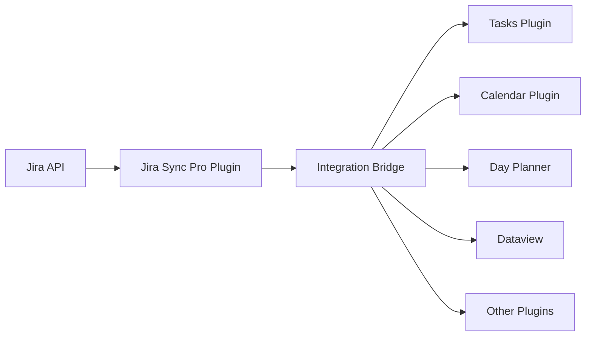

# Implementation Plan: Plugin Integration Enhancement for Jira Sync Pro

## Overview
Enhance the existing `obsidian-jira-sync-pro` plugin to enable integration with other Obsidian plugins, allowing Jira data to be shared with Tasks, Calendar, Day Planner, Dataview, and other productivity plugins.

## Current State Analysis

### Existing Plugin Capabilities
- **JQL-based sync**: Flexible query engine for fetching specific tickets
- **Auto-sync scheduler**: 5-minute interval automatic updates
- **Bulk import**: Handles 1000+ tickets efficiently  
- **Enhanced dashboard**: Real-time sync status monitoring
- **Jira Bases integration**: Extended functionality support

### Plugin Architecture
```
src/
├── jira-bases-adapter/    # Jira API client
├── enhanced-sync/          # Sync engine & scheduler
├── models/                 # Data models
├── settings/              # Configuration management
├── sync/                  # Core sync logic
├── ui/                    # Dashboard & UI components
└── main.ts                # Plugin entry point
```

## Integration Architecture Design

### Core Concept: Integration Bridge
Add a new **Integration Bridge** module that acts as a middleware layer between your Jira sync functionality and other Obsidian plugins.



### Key Components to Add

1. **Event System**: Emit events when Jira data changes
2. **Plugin Registry**: Detect and manage integrated plugins
3. **Data Provider API**: Standardized interface for data access
4. **Adapters**: Plugin-specific data transformers
5. **Permission Manager**: Control data access per plugin

## Implementation Phases

### Phase 1: Foundation (Week 1)
**Goal**: Build core integration infrastructure without breaking existing functionality

**New Files**:
- `src/integrations/IntegrationBridge.ts` - Central coordinator
- `src/integrations/EventBus.ts` - Event emission system
- `src/integrations/PluginRegistry.ts` - Plugin detection & management
- `src/integrations/DataProvider.ts` - Unified data access API

**Modified Files**:
- `src/main.ts` - Initialize IntegrationBridge
- `src/jira-bases-adapter/jira-client.ts` - Add event emissions
- `src/enhanced-sync/auto-sync-scheduler.ts` - Trigger integration updates

### Phase 2: Plugin Adapters (Week 2)
**Goal**: Create specific integrations for high-priority plugins

**Priority 1 - Tasks Plugin**:
- Convert Jira tickets to task format
- Add metadata (#jira/PROJ-123, due dates, priorities)
- Bidirectional sync (task completion → Jira status)

**Priority 2 - Calendar/Day Planner**:
- Generate calendar events from due dates
- Time block creation from story points
- Link events back to tickets

**Priority 3 - Dataview**:
- Custom data source for queries
- Live dashboard widgets
- Velocity and workload metrics

### Phase 3: UI & Configuration (Week 3)
**Goal**: User-friendly integration management

- Integration settings tab
- Plugin discovery interface
- Permission configuration
- Status indicators in dashboard

## Technical Implementation Details

### Event System
```typescript
// New event types to emit
enum JiraIntegrationEvent {
  TICKET_CREATED = 'jira:ticket:created',
  TICKET_UPDATED = 'jira:ticket:updated',
  TICKET_DELETED = 'jira:ticket:deleted',
  SYNC_COMPLETED = 'jira:sync:completed',
  STATUS_CHANGED = 'jira:ticket:status_changed'
}

// Integration Bridge will manage subscriptions
class IntegrationBridge {
  private eventBus: EventEmitter;
  private registry: PluginRegistry;
  
  emitTicketUpdate(ticket: JiraTicket) {
    this.eventBus.emit(JiraIntegrationEvent.TICKET_UPDATED, {
      ticket,
      timestamp: Date.now(),
      source: 'jira-sync-pro'
    });
  }
}
```

### Tasks Plugin Integration Example
```typescript
class TasksPluginAdapter {
  convertToTask(ticket: JiraTicket): ObsidianTask {
    return {
      text: ticket.summary,
      completed: ticket.status === 'Done',
      due: ticket.dueDate,
      tags: [`#jira/${ticket.key}`],
      priority: this.mapPriority(ticket.priority),
      metadata: {
        jiraId: ticket.key,
        jiraUrl: ticket.url,
        syncedAt: Date.now()
      }
    };
  }
  
  handleTaskCompletion(taskId: string) {
    const ticket = this.findLinkedTicket(taskId);
    if (ticket) {
      this.jiraClient.updateStatus(ticket.key, 'Done');
    }
  }
}
```

### Data Access API
```typescript
// Public API for other plugins
interface JiraDataAPI {
  // Query tickets
  getTickets(filter?: JiraFilter): Promise<JiraTicket[]>;
  getTicket(key: string): Promise<JiraTicket>;
  
  // Subscribe to changes
  subscribe(event: string, callback: Function): Subscription;
  
  // Check permissions
  hasPermission(plugin: string, action: string): boolean;
}
```

## Backward Compatibility Strategy

1. **Feature Flags**: Add integration features behind toggles
2. **Gradual Rollout**: Start with opt-in beta for integrations
3. **No Breaking Changes**: Existing sync functionality unchanged
4. **Version Detection**: Check plugin versions for compatibility

## Testing Strategy

### Integration Tests
- Mock plugin interactions
- Test event propagation
- Verify data transformations
- Check error handling

### Performance Tests
- Measure sync overhead with integrations
- Test with multiple active integrations
- Verify <50ms event processing

### Compatibility Tests
- Test with various Obsidian versions
- Verify plugin version compatibility
- Check graceful degradation

## Success Metrics

- **Zero Performance Impact**: Existing sync maintains current speed
- **Plugin Support**: 5+ simultaneous integrations
- **Response Time**: <50ms for integration events
- **Adoption**: 50% of users enable at least one integration
- **Reliability**: <0.1% error rate in production

## Risk Mitigation

### Technical Risks
- **Plugin API Changes**: Use version detection and fallbacks
- **Performance Degradation**: Implement circuit breakers
- **Data Conflicts**: Use optimistic locking and conflict resolution

### User Experience Risks
- **Complexity**: Hide integration details behind simple toggles
- **Breaking Changes**: Extensive testing before release
- **Documentation**: Comprehensive guides and examples

## Timeline

### Week 1: Foundation
- Integration Bridge core
- Event system
- Basic plugin detection

### Week 2: Plugin Adapters
- Tasks plugin integration
- Calendar/Day Planner
- Dataview support

### Week 3: Polish
- Settings UI
- Documentation
- Testing & bug fixes

### Week 4: Release
- Beta testing
- Performance optimization
- Production release

## Next Steps

1. **Start with T001-T005**: Create integration foundation
2. **Test with Tasks Plugin**: Most valuable integration first
3. **Gather Feedback**: Beta test with power users
4. **Iterate**: Refine based on usage patterns

---

*This plan enhances your existing plugin rather than creating a new one, preserving all current functionality while adding powerful integration capabilities.*